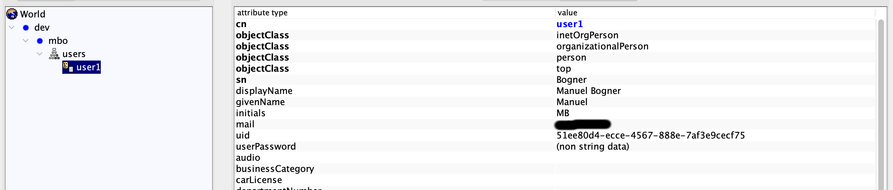
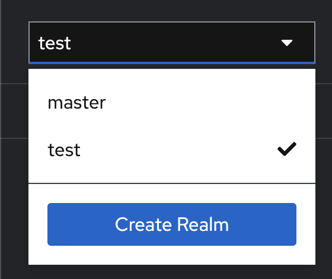
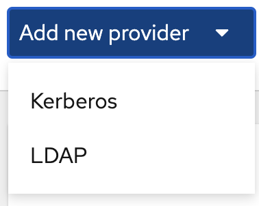
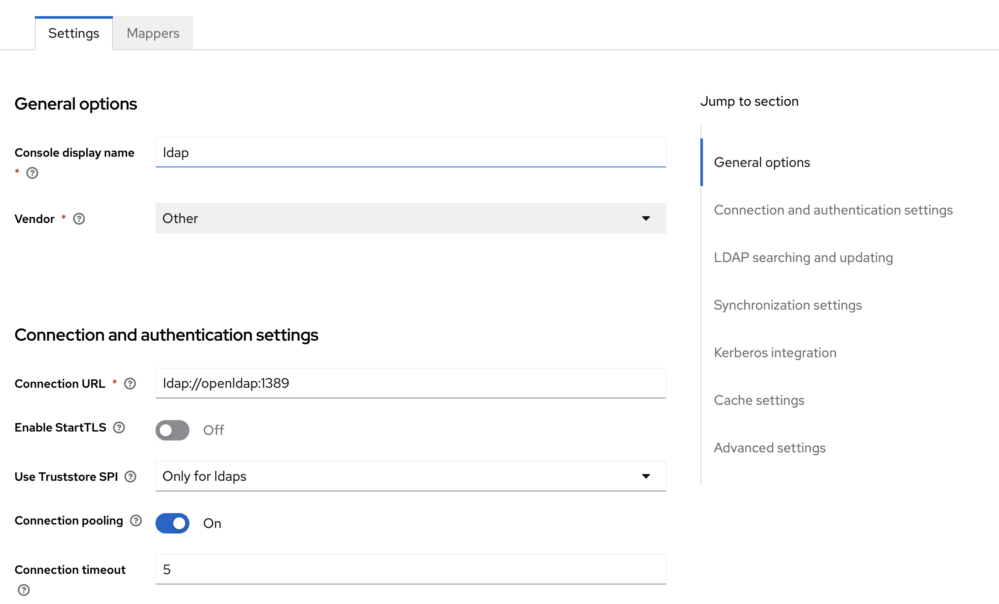
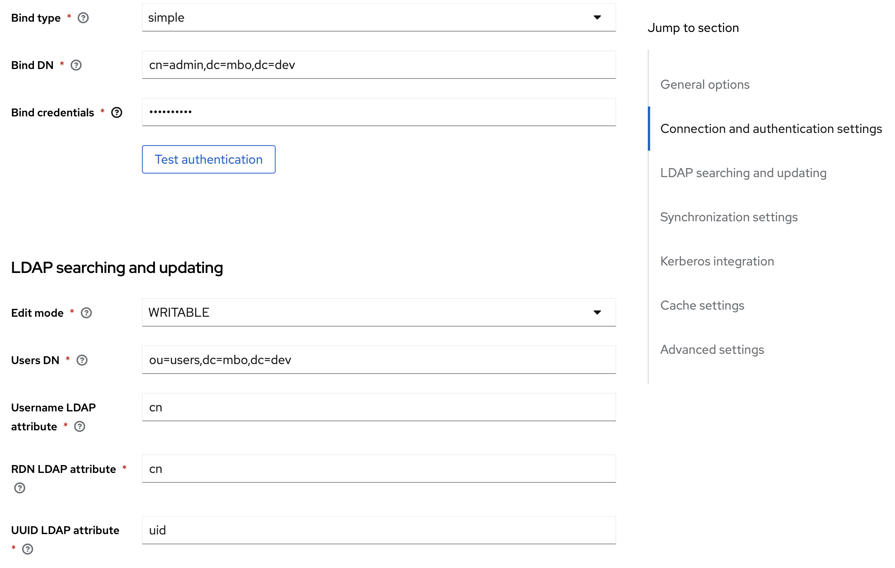
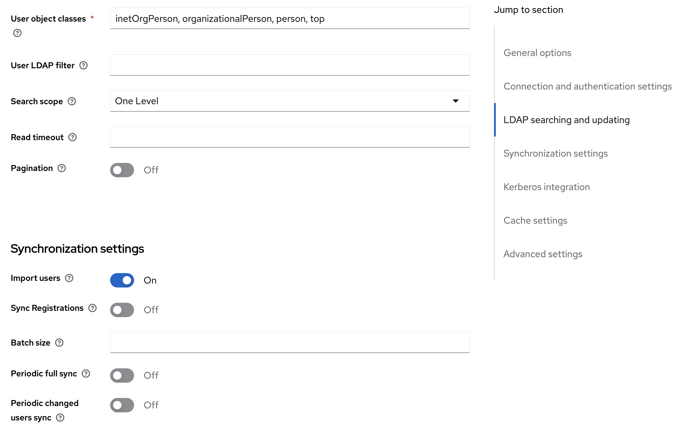
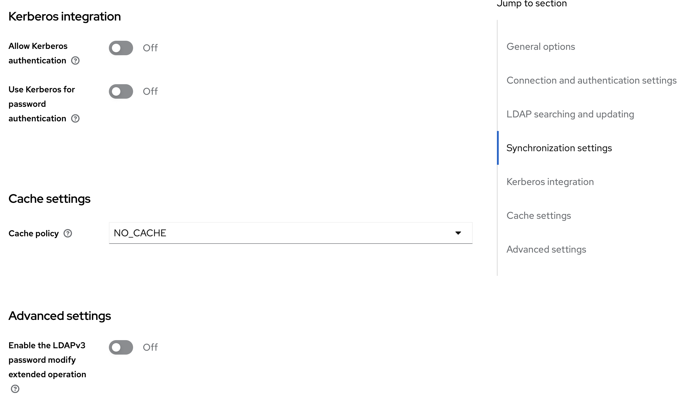
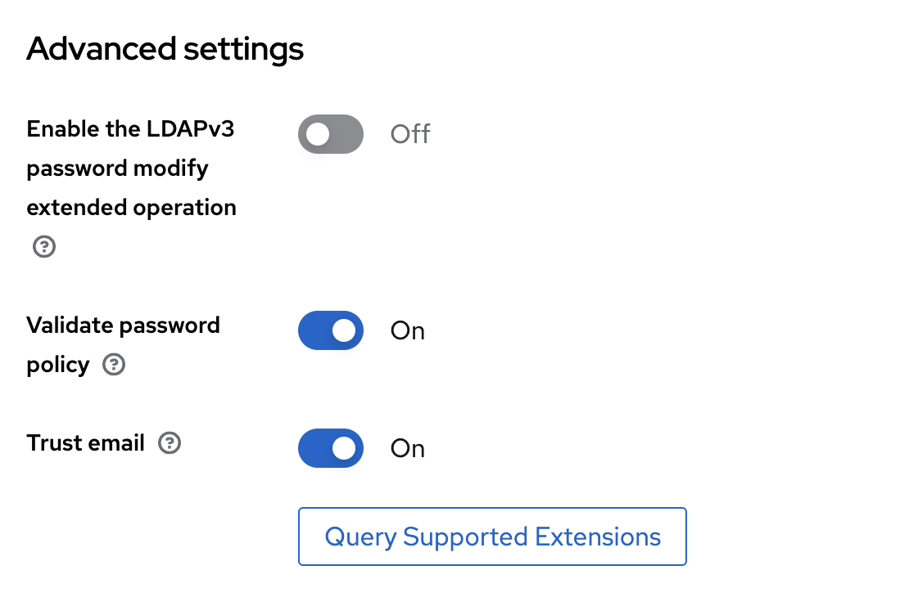

## Configuration

### LDAP

First a proper LDAP entry needs to be created as shown here

With this in place you can configure your keycloak instance.

### Keycloak

First create a new realm. The name doesn't matter.

Then configure a new entry under User Federation:

Then configure the new entry as shown below:

With this in place you can already login with the ldap user.